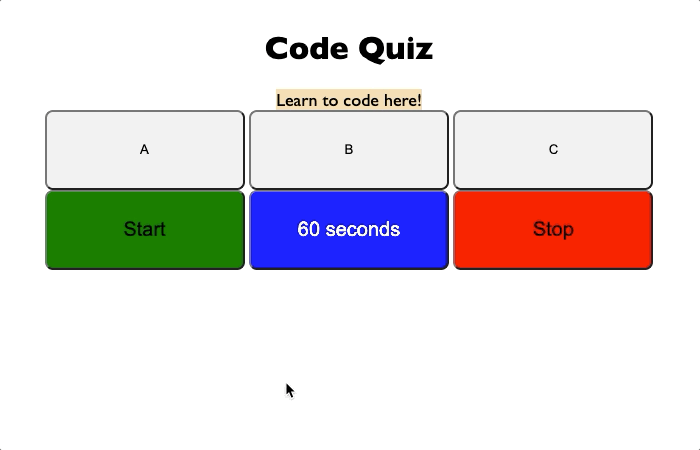

# code-quiz
## Learn coding from a simple quiz!  

<!-- Instructions for use -->
Link to site: https://jamesboblak.github.io/code-quiz/  
Click start to reveal first question, then 60-second countsown timer will start as soon as you choose your first answer.
  

<!-- Statement of purpose -->
## Purpose
Learn several of the most common coding acronyms  
## Technology utilized to create this page:
<!-- JavaScript Pionts -->
* JavaScript
    * Functions and nested functions
    * Timer functions
    * Get elements by ID and push text and variable values  

    <!-- CSS Points -->
* CSS
    * Mouse hover and click event listeners
    * Custom element, class and ID stylings  

<!-- Browser compatiblity -->
## Compatiblity and Installation
This HTML website, its CSS style document, and its JavaScript file were created and tested for Chrome, but will load in any browser.  Most modern browsers should play the content of this page as intended, and without issue.  

<!-- Credits -->
## Credits:
Berkeley Coding Boot Camp | UC Berkeley Extension, w3schools.com, developer.mozilla.org  

<!-- License agreement -->
## License
GNU General Public License v3.0  

<!-- Social badges -->
## Badges
